# Tutorial: Cara Membuat Pull Request (PR)

Panduan dari **membuat branch** sampai **PR diajukan** ke `dev`.

> **Pull Request (PR)** = permintaan ke ketua divisi: _"Tolong cek kerjaanku, lalu gabungkan ke `dev`."_ Kerjaan tidak boleh dikirim langsung ke `dev` atau `main`, jadi semuanya lewat PR.

**Alur dari awal pembuatan fitur:** cek branch (pastikan tidak di branch main/dev) → buat branch (jika masih di di branch main/dev)→ kerjakan → add + cek branch + commit → gabung `dev` → cek aplikasi → push → buka PR.

Belum punya repo di laptop? Lihat [readme.md](readme.md). Aturan tim (nama branch, format commit) ada di [GIT_WORKFLOW.md](GIT_WORKFLOW.md).

---

## Bagian 1: Di Laptop

### Langkah 1: Cek kamu di branch mana

```bash
git branch
```

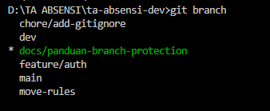

📷 Branch yang aktif ditandai **`*`** (biasanya hijau). Kalau `main` atau `dev`, jangan coding di situ, lanjut ke Langkah 2. (Layar berubah jadi mode baca? Tekan `q`.)

### Langkah 2: Buat branch baru dari `dev`

> ⚠️ **Branch baru selalu dari `dev`, bukan dari `main`.** PR-mu menuju `dev`, jadi branchmu harus berangkat dari `dev` yang terbaru.

```bash
git fetch origin
git switch -c feature/nama-tugas --no-track origin/dev
```

Nama branch: `jenis/nama-singkat`, huruf kecil, pakai `-`. Contoh: `feature/login-page`, `fix/otp-timer`, `docs/tutorial-pr`.

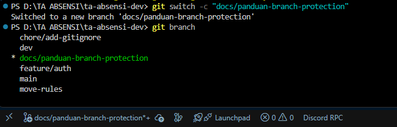

📷 `Switched to a new branch '...'` = berhasil. Nama branch aktif juga tampil di **pojok kiri bawah VS Code**. Kalau masih `main`/`dev`, ulangi langkah ini.

> Command di screenshot lebih pendek. Untuk tugas sungguhan, **pakai command lengkap di atas**.

### Langkah 3: Kerjakan tugasmu

Coding seperti biasa. **Satu branch = satu tugas.**

### Langkah 4: Add dan commit

**a. Lihat perubahan:**

```bash
git status
```

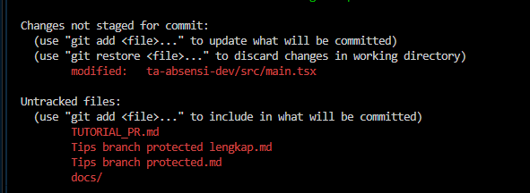

📷 Tulisan **merah** = belum masuk commit. _Changes not staged_ = file lama yang diubah, _Untracked files_ = file baru.

**b. Siapkan file:**

```bash
git add .
```

> Pakai `git add .` hanya kalau semua file di `git status` memang hasil kerjamu. Ada file lain atau `.env`? Tambahkan satu-satu: `git add nama-file`.

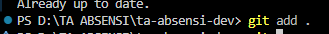

📷 Tidak ada tulisan error = berhasil. Jalankan `git status` lagi untuk memastikan:

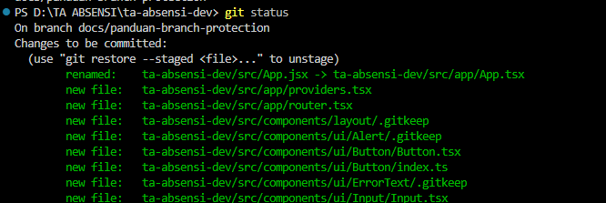

📷 File **hijau** di _Changes to be committed_ = siap di-commit. **Baca daftarnya**, pastikan hanya file hasil kerjamu. Baris `On branch ...` di atas juga menunjukkan branch aktif.

**c. 🛑 Cek branch sebelum commit** (jangan dilewati):

```bash
git branch
```

Tanda `*` harus di **branch fiturmu**. Kalau di `main`/`dev`, **berhenti**: buat branch baru dulu dengan `git switch -c nama-branch` (perubahanmu ikut terbawa).

**d. Commit:**

```bash
git commit -m "feat: tambah halaman login"
```

Format: `tipe: deskripsi` (`feat`, `fix`, `docs`, `style`, `refactor`, `chore`). Jelaskan apa yang berubah, bukan cuma `update` atau `fix`. Contoh: `fix: perbaiki timer OTP tidak reset`.

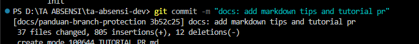

📷 Baris pertama `[nama-branch kode]` menunjukkan commit masuk ke branch mana. Cek juga jumlah file (`files changed`): kalau jauh lebih banyak dari yang kamu kerjakan, ada file nyasar. Periksa dulu sebelum push.

### Langkah 5: Gabungkan `dev` terbaru

Teman mungkin sudah menggabungkan PR mereka ke `dev`. Ambil dulu supaya tidak bentrok:

```bash
git fetch origin
git merge origin/dev
```

| Hasil                                          | Yang dilakukan                                                                     |
| ---------------------------------------------- | ---------------------------------------------------------------------------------- |
| `Already up to date.` atau daftar file berubah | Lanjut ke Langkah 6                                                                |
| `CONFLICT ...`                                 | Bentrok. Ikuti _Situasi 5_ di [TIPS_BRANCH_PROTECTED.md](TIPS_BRANCH_PROTECTED.md) |

> Mau mengintip bentrok sebelum menggabungkan? Lihat _Situasi 3_ di file Tips yang sama.

### Langkah 6: Pastikan aplikasi masih jalan

```bash
cd ta-absensi-dev
npm run dev
```

Coba fitur yang kamu kerjakan di browser. Kalau ada, jalankan juga `npm run lint` dan `npm run build`. **Jangan kirim PR kalau aplikasi error.**

### Langkah 7: Push

Kembali ke folder utama repo (`cd ..` kalau tadi masuk `ta-absensi-dev`), lalu:

```bash
git branch
git push -u origin feature/nama-tugas
```

Cek sekali lagi: tanda `*` harus di branch fiturmu. Kalau berhasil, terminal menampilkan tulisan _"Create a pull request for '...' on GitHub by visiting: ..."_.

<!-- TODO: screenshot hasil git push -> docs/step7-push.png
 -->

---

## Bagian 2: Di GitHub

### Langkah 8: Buka halaman PR

Pilih salah satu cara.

**Cara 1: lewat banner (paling cepat).** Setelah push, muncul banner kuning di halaman repo atau tab _Pull requests_. Klik **Compare & pull request**.

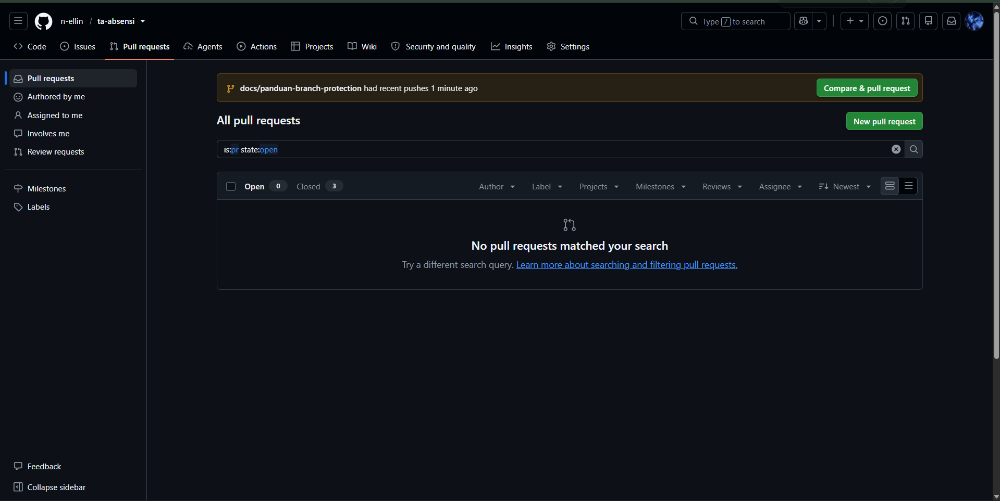

📷 Banner hilang setelah beberapa waktu. Kalau tidak muncul, pakai Cara 2.

**Cara 2: manual.** Buka tab **Pull requests**, klik **New pull request** (tombol hijau kanan atas, lihat gambar di atas), lalu pilih branch di halaman _Comparing changes_.

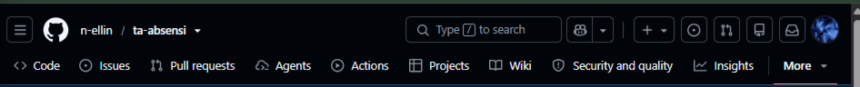

📷 Kalau layar kecil, tab terlipat di tombol **More**.

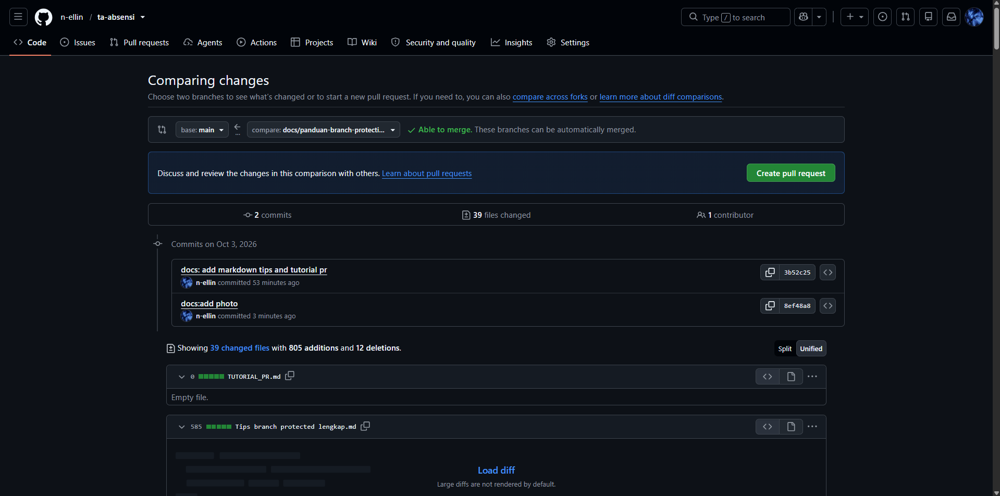

📷 Kotak **`base`** = tujuan PR, **`compare`** = branch kamu. Di screenshot ini `base` masih `main`, **ganti ke `dev`** (Langkah 9). Tulisan hijau _Able to merge_ = tidak bentrok. Cek juga jumlah **files changed**: kalau terlalu banyak, ada file nyasar.

### Langkah 9: Pastikan tujuan PR ke `dev` ⚠️

Langkah yang **paling sering salah**. Cek bagian atas halaman:

```
base: dev   ←   compare: feature/nama-tugas
```

GitHub sering memilih `main` otomatis. Kalau `base` masih `main`, **klik dan ganti ke `dev`**.

**❌ Salah** (`base: main`):

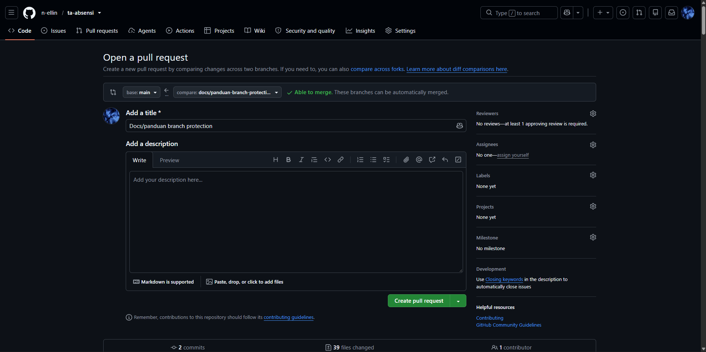

**✅ Benar** (`base: dev`):

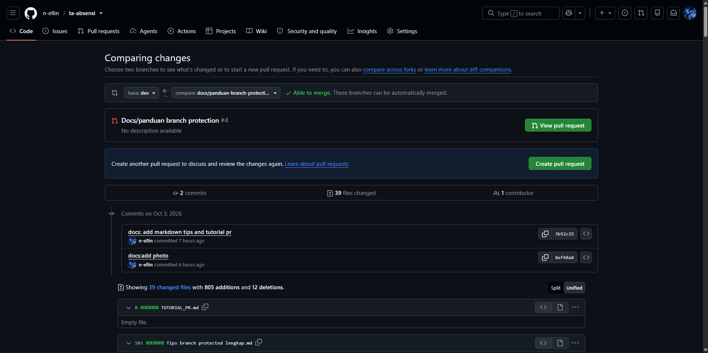

📷 Kalau muncul kotak PR yang sudah ada (contoh _"Docs/panduan branch protection #4"_ dengan tombol **View pull request**), berarti PR untuk branch ini **sudah pernah dibuat**. Klik **View pull request**, tidak perlu buat baru.

### Langkah 10: Isi detail dan kirim PR

**Judul:** pakai format commit, misal `feat: tambah halaman login`.

**Deskripsi:** salin template ini lalu isi.

```md
## Ringkasan

Apa yang dikerjakan (1-3 kalimat).

## Perubahan

- ...

## Cara Test

1. ...

## Checklist

- [ ] Sudah gabungkan `dev` terbaru
- [ ] Aplikasi jalan tanpa error
- [ ] Tidak ada `.env` atau `console.log` yang tertinggal
```

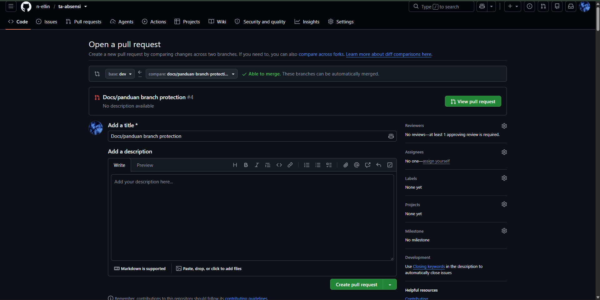

📷 **Add a title** otomatis terisi dari nama branch, jadi **ganti** dengan format commit. **Add a description** mendukung Markdown (tab _Preview_ untuk melihat hasil), dan screenshot bisa langsung diseret ke kolomnya. Di **kolom kanan**, klik ⚙ di **Reviewers** untuk memilih pengecek PR (repo ini butuh minimal **1 approval**). Terakhir klik **Create pull request**.

> Belum selesai tapi ingin dilihat dulu? Klik panah kecil di tombol hijau, pilih **Create draft pull request**.

<!-- TODO: screenshot PR setelah dibuat -> docs/pr-berhasil.png
 -->

🎉 **PR-mu sudah diajukan.** Buka tab **Files changed** dan baca ulang perubahanmu sendiri (cari file nyasar, `.env`, atau `console.log` yang tertinggal).

---

## Setelah PR Diajukan

| Situasi                                | Yang dilakukan                                                                                            |
| -------------------------------------- | --------------------------------------------------------------------------------------------------------- |
| Reviewer minta perbaikan               | Edit di **branch yang sama** → `git add` → cek branch → `git commit` → `git push`. PR ter-update otomatis |
| Muncul **"This branch has conflicts"** | `git fetch origin` → `git merge origin/dev` → selesaikan bentrok (Situasi 5 di file Tips) → `git push`    |
| PR sudah di-merge                      | Tugas berikutnya pakai **branch baru** (Langkah 2). Jangan pakai branch lama                              |

## Kesalahan yang Sering Terjadi

| Kesalahan                                        | Cara menghindari                         |
| ------------------------------------------------ | ---------------------------------------- |
| Commit tanpa cek branch (nyasar di `main`/`dev`) | `git branch` sebelum commit (Langkah 4c) |
| `base` PR masih `main`                           | Cek Langkah 9                            |
| Branch dibuat dari `main`                        | Buat dari `origin/dev` (Langkah 2)       |
| `git add .` membawa file bukan milikmu           | Baca daftar hijau di `git status`        |
| Lupa gabung `dev` terbaru                        | Lakukan Langkah 5                        |
| Satu PR isinya banyak tugas                      | Satu branch = satu tugas                 |
